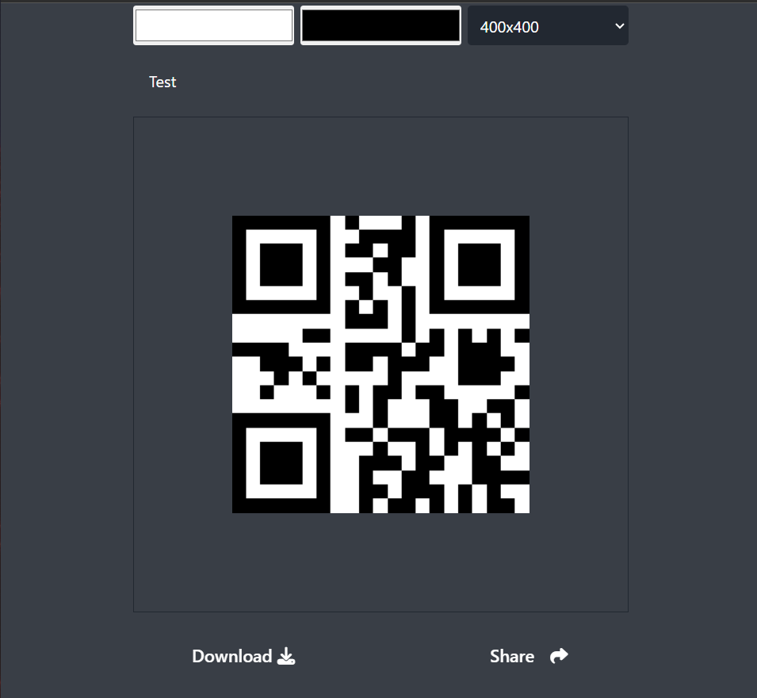

# QR Creator 🎯

**QR Creator** is a sleek, responsive web application that allows users to generate customizable QR codes in real time. It supports live preview, custom colors, multiple sizes, and quick download/share functionality. 
---

## 📸 Preview

---

## 📂 Project Structure
qr-creator/

├── index.html # Main HTML structure

├── style.css # Tailwind-based custom styles

├── script.js # Logic to generate and manage QR codes

├── preview.png # Screenshot (for README or project preview)

---

## 🚀 Features

- 🎨 Customize **foreground** and **background** QR code colors
- 📏 Select from various **QR code sizes**
- 🔍 Live **preview** of QR code while typing
- 📥 **Download** QR code as image
- 📤 **Share** QR code directly (if browser supports Web Share API)

---

## 💡 Technologies Used

- HTML5, CSS3
- [Tailwind CSS](https://tailwindcss.com/)
- Vanilla JavaScript
- [QRCode.js](https://cdnjs.com/libraries/qrcodejs)
- Font Awesome (for icons)

---

## 🧠 How It Works

1. User enters a URL or any text into the input field.
2. Selects the color and size preferences.
3. A QR Code is generated dynamically using **QRCode.js**.
4. Options to **download** or **share** are enabled.

---

## 🧠 Credits
[Inspired by AsmrProg's 100 Days of JavaScript - Day 4](https://github.com/AsmrProg-YT/100-days-of-javascript/tree/master/Day%20%2304%20-%20QR%20Code%20Generator)